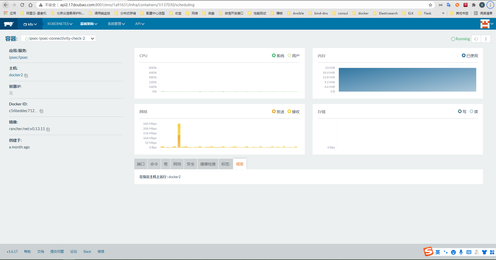

# 遇到的问题
### Killing container with id docker://log-collector:Need to kill Pod  
问题原因：  
- 这个问题是Kubernetes偶发的BUG    

解决办法： 
- kubectl delete pod xxxxxx --grace-period=0 --force  

### cannot join network of a non running container: 3984a6f59a3b015e85f6971deae08b5871c849de3fb6156189efd983a06dae22  
问题原因：  
    这个是rancher部署的k8s的ipsec网络组件出现问题, 表现为故障节点的ipsec容器不能docker exec -it 容器id /bin/bash进去容器,一个ipsec unhealthy, 然后渐渐的所有的ipsec都ipsec unhealthy，然后看到rancher k8s UI界面点开ipsec提示Degraded(降级)，然后所有的网络组件都被降级了  

错误表现(CrashLoopBackOff)：  

```
    ai            doubao-ai-core-prod-74697999b7-cwqhp                              0/1       CrashLoopBackOff   223        19h  
    commession    doubao-commession-secretary-prod-9cbbf6f76-wzwfm                  0/1       CrashLoopBackOff   223        19h  
    contract      doubao-contract-receive-data-prod-65cc6f568c-9g8jm                0/1       CrashLoopBackOff   224        19h  
    contract      doubao-contract-zazx-client2-prod-74c957b8b7-jfldv                0/1       CrashLoopBackOff   223        19h  
    default       whoami-deployment-5f4bdb7b46-5mqx6                                0/1       CrashLoopBackOff   49         4h  
    default       whoami-deployment-5f4bdb7b46-wxlvr                                0/1       CrashLoopBackOff   50         4h  
    finance       doubao-finance-data-transfer-prod-88f878945-n7lk2                 0/1       CrashLoopBackOff   34         2h  
    finance       doubao-finance-data-transfer-prod-88f878945-qklg9                 0/1       CrashLoopBackOff   10         34m  
    finance       doubao-finance-data-transfer-prod-88f878945-zdl9n                 0/1       CrashLoopBackOff   33         2h  
    health        doubao-health-accesstoken-prod-5f89494b6f-qm6jm                   0/1       CrashLoopBackOff   222        19h  
    health        doubao-health-product-lib-prod-7d9d5dd7c6-vg24x                   0/1       Pending            0          4h  
```
   


解决办法:  
- 找到对应的容器然后直接docker rm -f 容器id
    
    